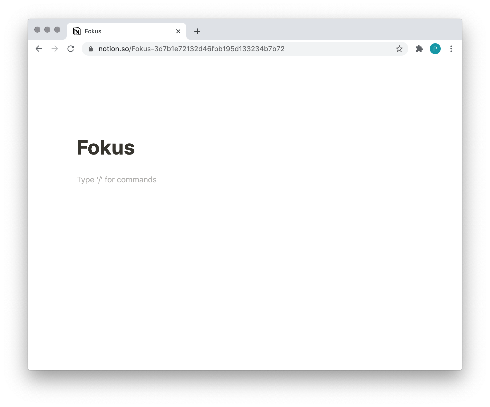
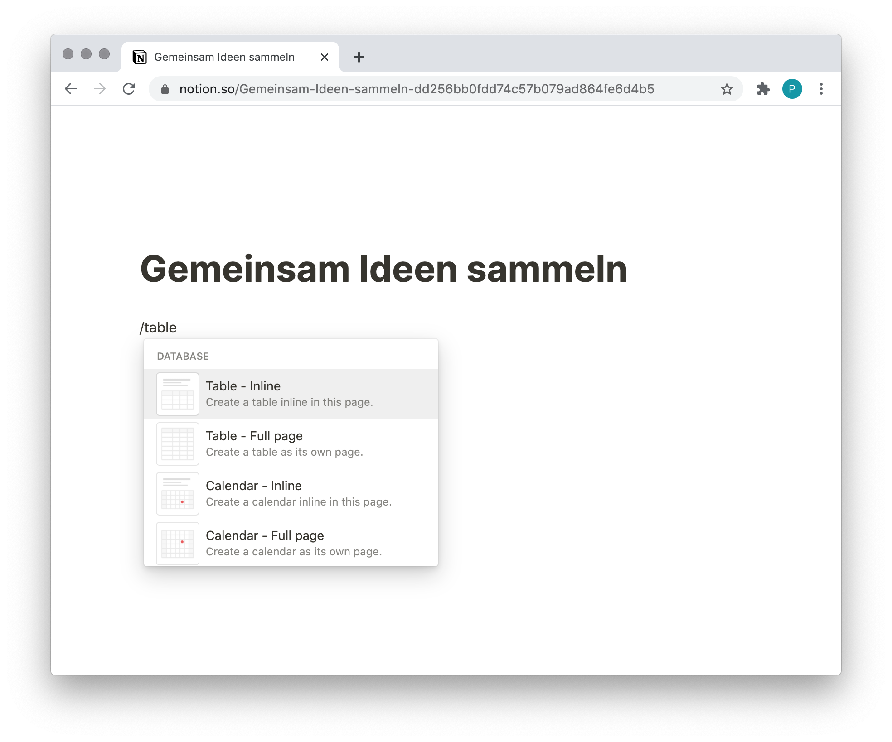
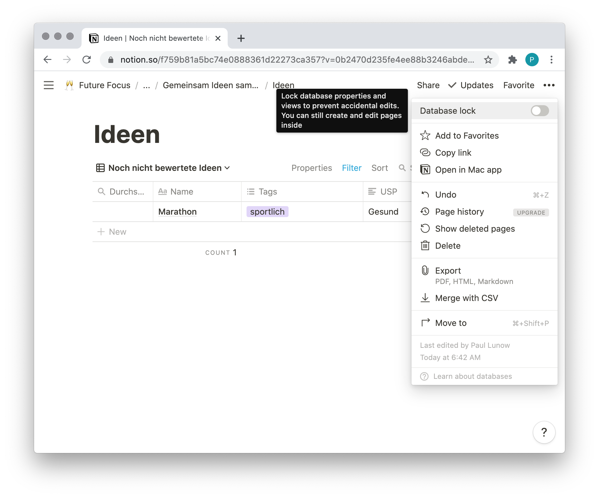
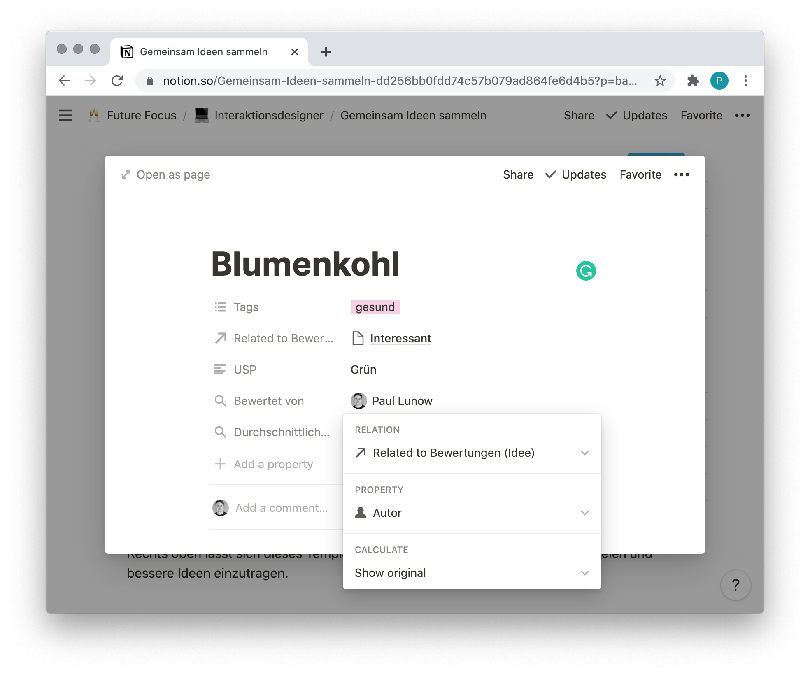
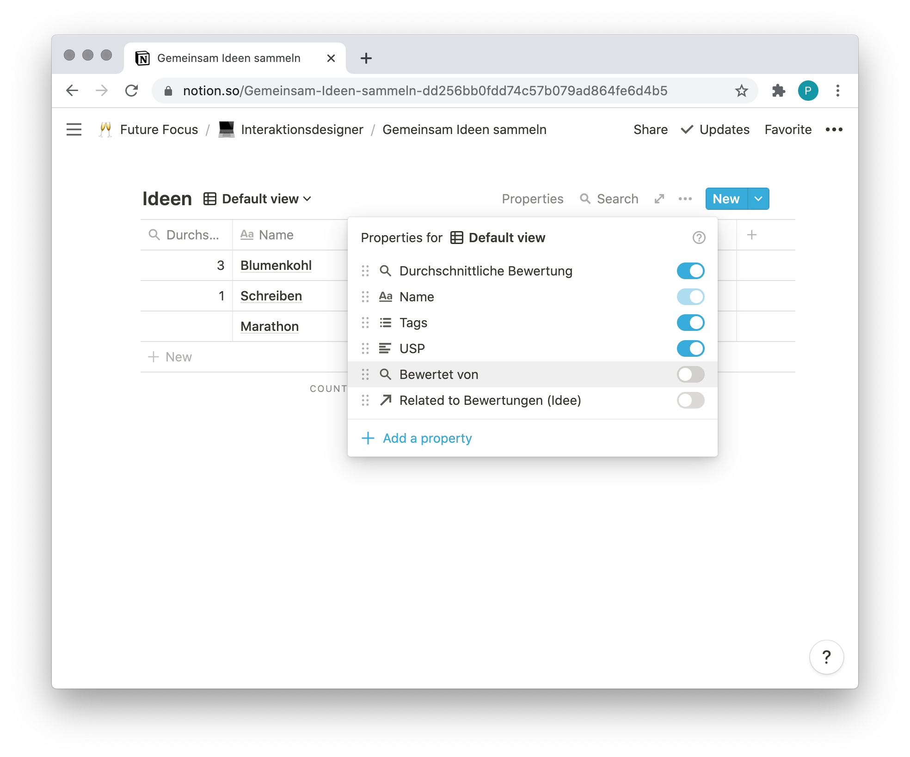
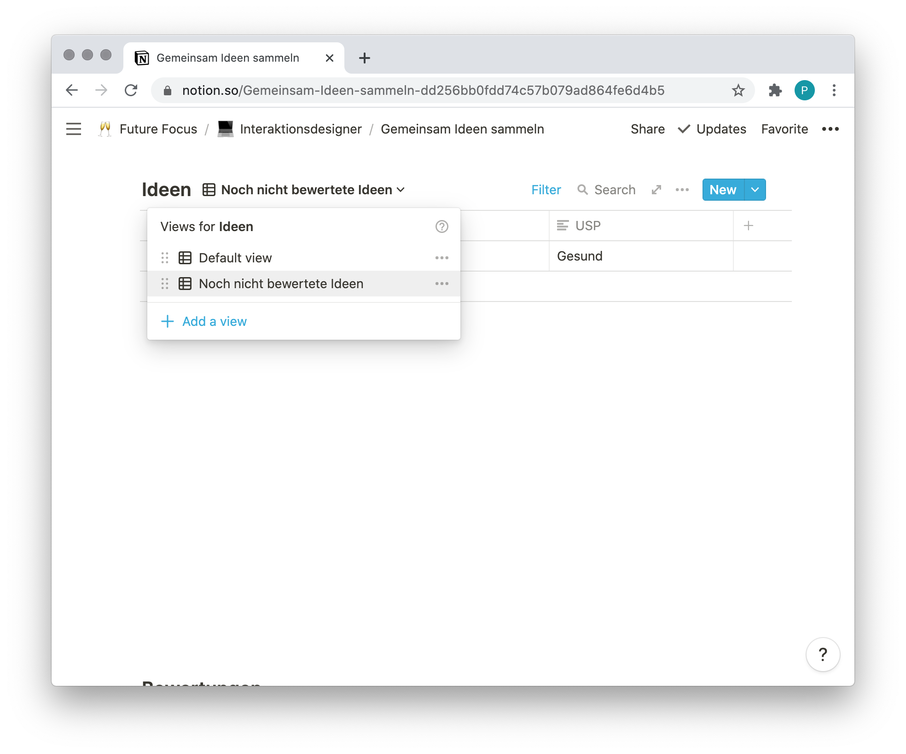
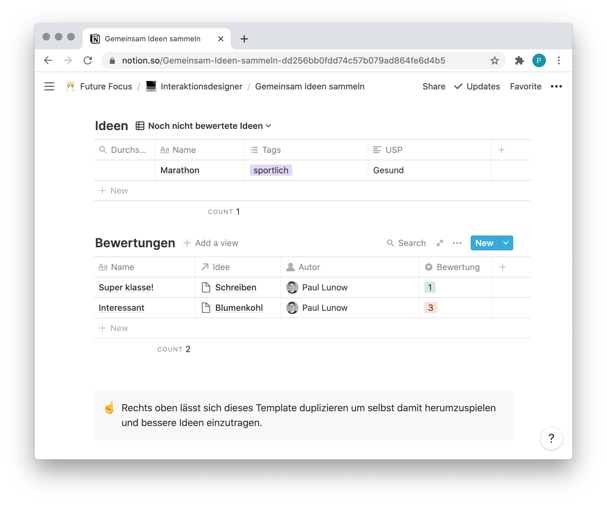

---

layout: post
title: "Datenbanken in Notion"
abstract: "Notion ist für mich die Entdeckung des letzten Jahres! Wir haben es urspünglich als Firmen-Wiki eingesetzt um unser Wissen besser zu strukturieren, aber jeden Tag übernimmt es mehr Aufgaben. Notion ist ein Werkzeug, mit dem praktisch alles umgesetzt werden kann. Zum Beispiel eine Seite um sich gemeinsam über Ideen auszutauschen."
categories: Notion
background: ol-ohne-titel

---

Einer der Gründe warum ich [Notion](https://www.notion.so) inzwischen auch für alle meine privaten Notizen einsetze, ist der Fokus Modus. Legt man eine neue Seite an und beginnt zu tippen, verschwinden alle Steuerelemente und die gesamte Konzentration bündlelt sich im Schreiben.



Aber mit ein paar Klicks lassen sich komplexe Datenstrukturen abbilden! Zum Beispiel um Ideen zu sammeln und im Team darüber abzustimmen und zu diskutieren.


## Datenbanken

In [Notion](https://www.notion.so) lassen sich zwei Datenbank anlegen: Tabellen als eigene Seite ("Full page") oder Tabellen als "Inline table". Ich wähle inzwischen immer letzteres, denn es erlaubt um die Tabelle herum weitere Informationen zu platzieren, einen Einleitungstext, Videos, Bilder usw.

Startet man also mit einer leeren Seite und tippt ein `/` öffnet sich ein Menü, in dem die verschiedenen Inhaltselemente ausgewählt werden können. Ein Klick auf "Table - inline" fügt eine Tabelle ein, ich nenne sie "Ideen". 



Vielleicht erinnert sich der ein oder andere an die [Datenbanknormalisierung](https://de.wikipedia.org/wiki/Normalisierung_(Datenbank)) aus dem Unterricht oder Studium. Falls nicht, gilt als Faustregel: Wenn man sich dabei wiederfindet, in mehreren Tabellen immer wieder die gleichen Felder anzulegen und Formeln zu kopieren, dann hat man einen Fehler gemacht. In Notion wie beim Programmieren ist der Regel zu folgen: Don't repeat yourself.

Notion bietet mit Filtern und Sortierung und "Linked Databases" die Möglichkeit, verschiedene Ansichten der Daten zu erzeugen. Dazu später mehr.


## Eine Liste mit Ideen

Es fängt einfach an, die Liste mit Ideen besteht aus den Spalten "Name", "Tags" und "USP" und kann sofort munter befüllt werden. Entweder klickt man in die Tabelle, wählt unten links das "+ New" aus oder rechts oben, innerhalb des Tabellenelements den Button "New" - hier verstecken sich noch Templates, auch ein sehr mächtiges Feature.

Rechts oben auf der Seite, hinter dem Link "Share" lässt sich die Seite mit den Menschen teilen, die auch gute Ideen haben.


## Ratings

Nun wächst die Liste mit Ideen und wir möchten eine Wertung einfügen. Und hier beginnt der Spaß und die Macht von Notion. Ein möglicher Weg wäre es die Wertungen als Eigenschaften der Ideen anzulegen, also ein Feld "Markus_Wertung", "Pauls_Wertung", "Claras_Wertung" usw. Das wird aber unübersichtlich und es lässt sich schlecht darüber diskutieren.

Statt dessen lege ich eine weitere Tabelle "Bewertungen" an. Ebenfalls als "Inline table", direkt unterhalb der Ideen. Jede Zeile in Notion braucht immer ein Name-Feld. Dieser Name wird dann in den Relationen angezeigt.

Jede Bewertung bezieht sich natürlich auf eine Idee. Es wird also die Eigenschaft "Idee" vom Typ "Relation" angelegt. Es öffnet sich ein Overlay, in dem die Datenbank ausgewählt wird, die verknüpft werden soll. In diesem Beispiel also "Ideen".

Nun soll auch visualisiert werden wer die Bewertung angelegt hat. Das weiß Notion sowieso und kann es einfach anzeigen. Eine weitere Eigenschaft anlegen mit dem Namen "Autor" und dem Typ "Created by".

Und schließlich die Wertung selbst. Hier kann natürlich beliebige Komplexität eingebaut werden, ich erstelle der Einfachheit nur ein Feld mit dem Titel "Bewertung" und dem Typ "Select". Zur Auswahl stehen drei Optionen: 1, 2 und 3.

Die Optionen trage ich einmal alle ein, dann können die nächsten Nutzenden einfach aus der Tabelle wählen. Öffnet man die Liste der Optionen und geht mit der Maus über eine, erscheinen in der Zeile rechts drei Punkte - darüber lässt sich der Name und die Farbe ändern. Wähle also drei schöne Farben - green, yellow und orange.


### Bewertung berechnen

Ein Select-Feld ist einfacher für die Nutzenden, aber mit dem Wert kann nicht weiter gerechnet werden. Deshalb muss die Auswahl in eine Zahl umgewandelt werden. Dazu eine weitere Eigenschaft anlegen "rating" vom Typ "Formula". Es passiert nichts, bis man auf das hellgraue "Empty" klickt und eine Formel definiert.

Hier öffnet sich ein ganzen fantastisches Universum an Möglichkeiten. Wir fangen jetzt aber einfach an und transformieren den Wert in eine Zahl.

```
toNumber(prop("Bewertung"))
```

Der Inhalt des Feldes "Bewertung" wird von Notion in eine Zahl umgewandelt. Nun könnte man natürlich auch Namen als Bewertung im Select Feld angeben ("Sehr gut", "Gut", "Mittel") und diese mit ein paar `if` Statements in Zahlen umwandeln. 


## Database lock

Nun ist es der Fall, dass der eine oder andere Gast wild herumklickt und die schöne Struktur erweitert. Das geht natürlich gar nicht. Deshalb will ich die eben angelegten Eigenschaften schützen. Dazu klickt man innerhalb des Tabellenelements, links neben dem "New" Button, auf die drei Punkte und wählt die Option "Open as page".



Auf der sich öffnenden Seite befindet sich nur noch die eben angelegte Tabelle. Rechts oben auf der Seite(!), neben dem "Share" Link befinden sich wieder drei Punkte. Die erste Option des Menüs heißt "Database lock" und ist genau was wir brauchen. Es lassen sich Inhalte anlegen, aber die Struktur kann nicht mehr verändert werden. Aktivieren!

Kleiner Hinweis am Rande: Diese Seite lässt sich (rechts oben) zu den Favoriten hinzufügen. Arbeitet man also ständig in einer Tabelle, die sich weit unten auf einer Seite befindet, holt man sie damit in den Schnellzugriff.


## Anzeigen der Bewertungen

Jetzt wird es spaßig! Die Bewertungen sollen jetzt in der Ideen Liste angezeigt werden. Notion hat schon selbst eine neue Eigenschaft hinzugefügt "Related to Bewertungen". Durch diese Beziehung lassen sich nun verschiedene Informationen aus der Tabelle Bewertung anzeigen. Zum Beispiel der Durchschnitt der abgegebenen Bewertungen.


### Wer hat schon bewertet?

Nichts leichter als das! Eine neue Eigenschaft anlegen mit dem Namen "Bewertet von" und dem Typ "Rollup". Dieses Rollup nimmt Daten aus einer verbundenen Datenbank und zeigt diese an. Nach der Auswahl passiert erstmal gar nichts, denn der Rollup muss noch konfiguriert werden. Dazu klickt man auf das hellgraue "Empty", neben der eben angelegten Eigenschaft.

"Select an exisisting relation..." - es gibt bisher nur eine, die Bewertungen. Als Property das Feld "Autor" wählen und im Feld "Calculate" ist automatisch der Wert "Show original" ausgewählt. Fertig!




### Durchschnitt der Bewertungen

Analog funktioniert es auch mit der Anzeige der Bewertungen. Wieder ein Feld "Rollup" mit dem Namen "Durchschnittliche Bewertung" anlegen, verbundene Datenbank auswählen. Diesmal das Feld mit der Zahl "rating" auswählen und als "Calculate" Option "Average".


### Übersichtliche Darstellung

Das war ja einfach! Nur ist die Tabelle "Ideen" recht unübersichtlich geworden. Links neben dem "New" Button, hinter den drei Punkten versteckt sich der Menüpunkt "Properties". Dieser kontrolliert welche Spalten angezeigt werden sollen. Ich mache alles aus, außer "Name", "Tags" und "Durchschnittlicher Bewertung". Per Drag-and-drop lässt sich die Reihenfolge der Spalten verändern - genauso die Spaltenbreite.



Ebenfalls hinter den drei Punkten, ganz unten im Menü, befindet sich die Option "Wrap cells". Diese kontrolliert ob der Inhalt einer Zelle abgeschnitten oder angezeigt werden soll. Falls mal mehr als ein Wort in einer Zelle steht.


## Views und Filter

Ein sehr mächtiges Konzept möchte ich noch vorstellen. Notion erlaubt unterschiedliche Darstellungen auf die Daten. Das heißt jede Tabelle lässt sich als Board, Gallerie, Liste und sogar als Kalender darstellen. Und jede Darstellung lässt sich unterschiedlich sortieren und filtern.

Denn in einer langen Liste von Ideen, weiß ich vielleicht nicht welche ich noch nicht bewertet habe. Fährt man mit der Maus über den Titel der Tabelle, erscheint rechts daneben der Link "+ Add a view". Diesem gibt man einen Namen "Noch nicht bewertete Ideen" und bleibt beim Typ "Tabelle". 



Über die drei Punkte, rechts oben, den Menüpunkt "Filter" auswählen. Im Filter-Menü ist unten der Link "+ Add a filter" und man fügt hinzu einen einzelnen Filter. Keine Gruppe.

Hier kann man eine fast menschliche Abfrage zusammen klicken: Where "Bewertet von", "None", "Contains" und dann die magische Option "Me". Dieses "Me" wird durch den jeweils angemeldeten Nutzernamen ersetzt. Das heißt, die Tabelle zeigt nun immer individuelle Ergebnisse!


## Fazit

Jede einzelne Idee und jede Bewertung ist nun eine eigene Notion Seite die mit Inhalt befüllt werden kann und eine Diskussion beinhaltet.

Notion ist ein so großartiges und vielfältiges Werkzeug, dass ich es inzwischen für fast alles benutze. Vom Schreiben über das Planen, als CRM, Aufgabenverwaltung und Zettelkasten.



Das Team dahinter ist großartig, es bietet einen super schnellen Support (rechts unten ist ein sehr unauffälliges Fragezeichen) und wird ständig weiter entwickelt.

Notion erlaubt es einzelne Seiten im Internet zu veröffentlichen und diese wiederum als Template in das eigene Notion zu übernehmen! Hier ist die oben beschriebene Seite: [Gemeinsam Ideen sammeln](https://www.notion.so/Notion-Datenbanken-dd256bb0fdd74c57b079ad864fe6d4b5).

Die Entwicklung von Notion geht rasend voran und hin und wieder funktionieren Dinge nicht, die in einem Tutorial beschrieben werden. In diesen Fällen hilft es [Notion zurück zu setzen](https://www.notion.so/Reset-Notion-1b70196f1f6145d7a8695afc425d8699). Das schlägt dann auch der Support meistens vor.

Ich möchte gern mehr über [Notion](https://www.notion.so) schreiben. [Schickt](https://www.paul-lunow.de) und schreibt also gern eure Fragen!