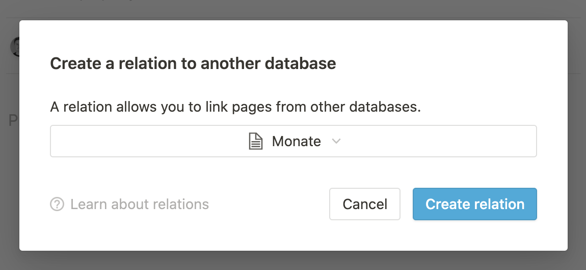
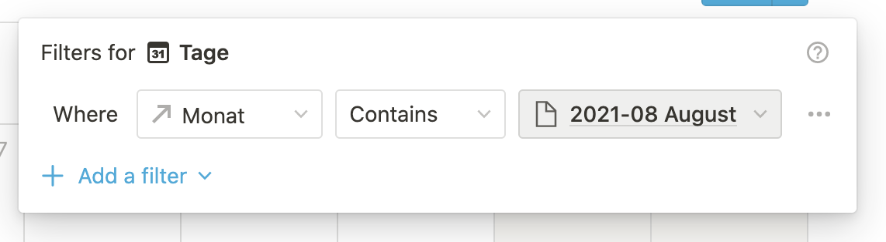
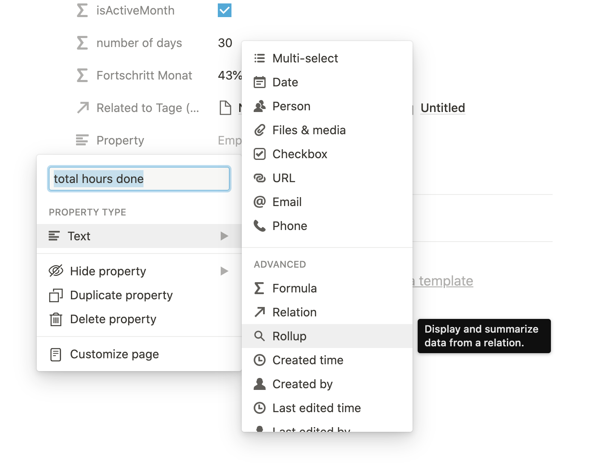
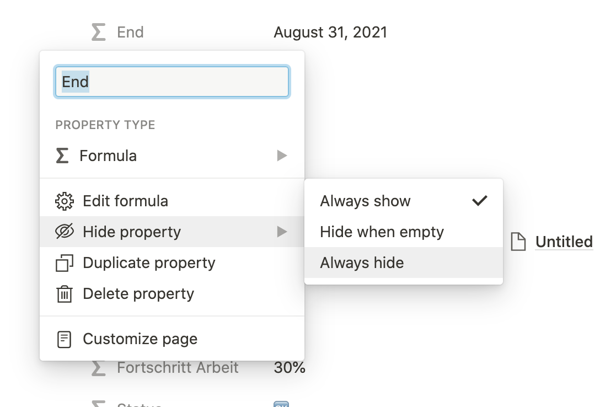
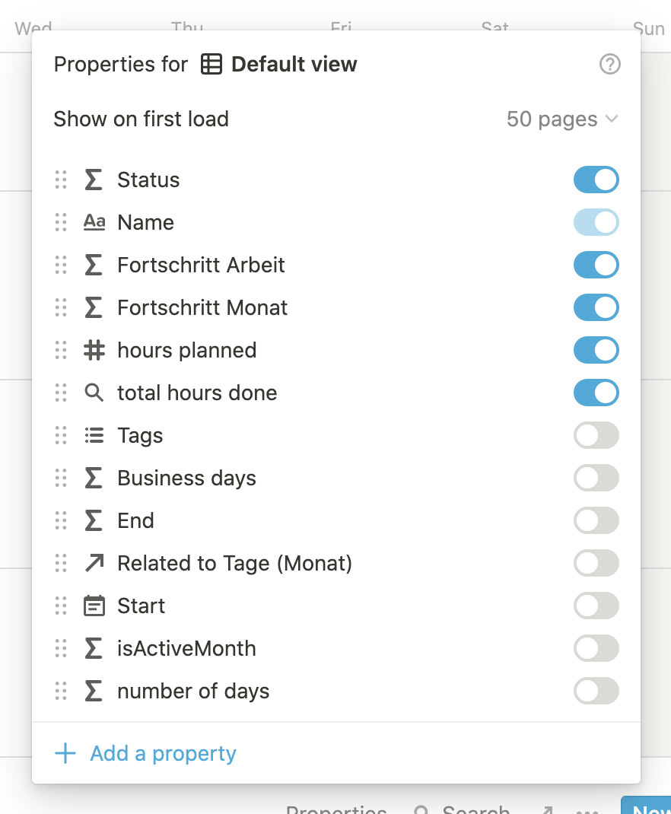

---

layout: post
title: "Timetracking mit Notion"
abstract: "Immer mehr Firmen präsentieren mir Stolz ihre Nutzung von Notion und viele Mitarbeitende sind so begeistert davon, dass sie auch ihr privates Leben damit organisieren. So mache ich das auch. Wichtige Checkpoints der Kinder, mein soziales Netzwerk, Lesezeichen, Rezepte, Ideen für das nächste Startup - alles in Notion. Und inzwischen auch meine Zeiterfassung. Ich möchte eine grobe Übersicht meiner investierten Zeit sehen, und dafür ist unsere liebste No-Code Plattform bestens geeignet."
categories: Notion
background: trioson

---

# Zeiterfassung in Notion

Ich habe eine Reihe von Apps auf dem Computer und auf dem Telefon mit denen ich mal meine Arbeitszeit erfasst habe. Unzählige Tabellen, Notizen und Dokumente und einen ganzen Stapel voller halb beschriebener Notizbücher.
Nichts hat sich durchgesetzt! In mein Timetracking möchte ich am Ende des Tages eintragen, wofür wie viel Zeit drauf gegangen ist. Und ein paar Gedanken nieder schreiben was an dem Tag passiert ist, was zukünftig verbessert werden soll.

Auftritt: Notion.

## Ein Kalenderblatt

Jede Datenbank in Notion kann als Kalender dargestellt werden. Um dieses zu bekommen, eine neue Seite anlegen und im Inhaltsbereich `/tabi` eingeben - Kurzform für: Table inline - dann Enter drücken.

Neben der Überschrift "Untiteld" versteckt sich ein Link "+ Add a view". In dem Menü dahinter einen Titel eingeben, z.B. "Tage" und die Ansicht "Calendar" auswählen.

Dies wird die Ansicht, in der jeder Tag einen Eintrag bekommt in dem Stunden und Notizen festgehalten sind. Fährt man mit der Maus über eine Kachel für einen Tag, erscheint links oben das kleine Plus Zeichen. Dort eine neue Eigenschaft erstellen mit dem Namen "Stunden" und dem Typen "Number".

## Eine Monatsübersicht

Unter dem Kalenderblatt, ebenfalls im Inhaltsbereich über `/tabi` eine neue Tabelle anlegen mit dem Titel "Monate". Das wird die Übersicht der Monate mit einigen statistischen Informationen.

Jeder Datenbankeintrag braucht einen Namen. Ich nehme `2021-08 August`, dann funktioniert die Sortierung nach Namen in chronologischer Reihenfolge.

Jetzt kommen ein paar coole Dinge um die Übersicht zu verbessern.

### Erster und letzter Tag im Monat

Von wann bis wann geht der Monat? Sofern man sich nicht der API bedienen möchte um auch diesen Schritt zu automatisieren, lege ich zwei Properties an.

"Start" -> Typ: Date. Hier den 1.8.21 auswählen.

"End" -> Typ: Formula. Jetzt wird es spannend. Mit einer Formel berechnet Notion den letzten Tag des Monats. 

	dateSubtract(dateAdd(dateSubtract(prop("Start"), date(prop("Start")) - 1, "days"), 1, "months"), 1, "days")

Red Gregory hat die Formel erstellt und in einer Liste mit [30 Date Formulas in Notion](https://www.redgregory.com/notion/30-date-formulas-in-notion-to-help-your-next-build) veröffentlicht.

### Anzahl Arbeitstage im Monat

Nun, da wir wissen von wann bis wann der Monat geht, soll berechnet werden wie viele Arbeitstage dazwischen liegen.

"Business days" -> Typ: Formula.

	dateBetween(prop("End"), empty(prop("Start")) ? dateSubtract(now(), 1, "days") : prop("Start"), "days") - dateBetween(prop("End"), empty(prop("Start")) ? dateSubtract(now(), 1, "days") : prop("Start"), "weeks") * 2 + ((dateBetween(prop("End"), empty(prop("Start")) ? dateSubtract(now(), 1, "days") : prop("Start"), "days") >= 0) ? 1 : (empty(prop("Start")) ? (-3) : (-1)))

Wer sich sowas ausdenkt? Das stammt aus dem Internet (Redit) und wird auf [einer Notion Seite](https://www.notion.so/Business-Days-51646eb4858d417d8ad66d53c34ea850) gesammelt.

### Befinden wir uns im aktuellen Monat?

Mit der Zeit sammeln sich in der Tabelle eine Reihe von Monaten an und ich möchte wissen, ob der gerade geöffnete Monat schon vorbei ist.

"isActiveMonth" -> Typ: Formula.

	month(now()) == month(prop("Start"))

Hab ich mir selbst ausgedacht! Notion versteht, dass der Rückgabewert nur wahr oder falsch sein kann und stellt automatisch ein Häckchen da. Sehr schön. Diese Information können wir in den weiteren Formeln nutzen.

### Wie viel Zeit ist vergangen?

Ich möchte gern in Prozent sehen, wie viel des Monats schon vergangen ist. Dafür brauche ich zum einen die Anzahl der Tage des Monats.

"number of days" -> Typ: Formula.

	dateBetween(prop("End"), prop("Start"), "days")

Jetzt stehen alle Informationen zur Verfügung um eine Prozentzahl auszurechnen, sofern der Monat noch aktiv ist.

	prop("isActiveMonth") ? date(now()) / prop("number of day") : 1

Bewegt man die Maus über das Ergebnis erscheint ganz rechts ein Button `123` in dem das Zahlenformat ausgewählt werden kann. Hier % auswählen. Das funktioniert, kann aber zur Anzeige von 0.345234234234% führen.

### Zahlen runden in Notion

Es gibt leider nur eine Formel um auf Ganzzahlen zu runden, was bei einem Prozentergebnis immer 0 oder 1 wäre. Deshalb muss das Ergebnis mit 100 multipliziert und danach wieder dividiert werden.

	prop("isActiveMonth") ? (round(date(now()) / prop("number of day") * 100) / 100) : 1

Die Anzahl der Nullen ist dabei die Anzahl der Stellen hinter dem Komma.

## Wie viel habe ich denn nun im Monat gearbeitet?

Jetzt werden noch die beiden Datenbanken verbunden. Dafür als erstes zurück zu den Tagen und eine neue Eigenschaft anlegen:

"Monat" -> Typ: Relation.

Im Popup die Datenbank "Monate" auswählen. Dort kann jetzt Manuell der Monat August ausgewählt werden, aber das vergisst man allzuhäufig.

Deshalb im Kalenderblatt, rechts oben auf die drei Punkte klicken und "Filter" auswählen. Hier die Eigenschaft "Monate" auswählen. "Contains" und dann den eben angelegten Eintrag "2021-08 August".

Legt man nun über das Plus Zeichen auf einem Tag einen neuen Eintrag an, beinhaltet der automatisch die Relation vom entsprechenden Monat. Ich lege dann jeden Monat einen eigenen "View" an der nach dem aktuellen Monat filtert.

### Anzahl der Stunden pro Monat

Wer fühlt sich schon wie ein super Hacker? Ich schon, ein bisschen. Und jetzt wird es noch krasser. Zurück im Eintrag des Monats eine neue Eigenschaft anlegen:

"total hours done" -> Typ: Rollup.

Danach, rechts neben der Eigenschaft auf "empty" klicken, die existierende Relation zu "Related to Tage (Monat)" auswählen. 
Dann Property "# Stunden".
Und bei bei Calculate: Sum.

Fertig! Notion nimmt nun alle Einträge aus der Tabelle "Tage" die über die Relation mit dem Monat verknüpft sind, und summiert alle angegebenen Stunden!

### Wie viel Arbeit ist geleistet?

Analog zu der Frage wie viel Zeit im Monat vergangen ist, lässt sich jetzt leicht berechnen, wie viele Stunden schon geleistet wurden.

Dafür eine Eigenschaft für den Zielwert angeben:

"hours planned" -> Typ: Number

Und danach eine zweite Formel:

"Fortschritt Arbeit" -> Typ: Formula

	round(prop("total hours done") / prop("hours planned") * 100) / 100

### Status

Wir alle lieben Emojis weil unsere Gehirne gern Muster erkennen. Also geben wir ihm (oder ihr) Futter.

"Status" -> Typ: Formula

	(prop("isActiveMonth") == false) ? "✅" : ((prop("Fortschritt Monat") - prop("Fortschritt Arbeit") > 0.2) ? "🖐🏼" : "🆗")

Wenn der Monat vorbei ist, wird ein grünes Häckchen angezeigt. Ist der Unterschied zwischen Fortschritt Arbeit und Monat größer als 20% bekommen wir eine warnende Hand, ansonsten das OK Zeichen. Das ist doch süß.

## Aufräumen

Nun sind wir fast am Ende der ersten Itteration. Aber wir wollen kein Wirrwarr hinterlassen. Deswegen darf bei allen Eigenschaften mit dem Typ "Formula" die Sichtbarkeit auf "Always hide" gestellt werden. Dafür mit der Maus über den Namen der Eigenschaft gehen und dann links auf die sechs Punkte, und dann "Hide property" -> "Always hide" auswählen.

In der Tabelle "Monate" lassen sich über die drei Punkte und die Eigenschaft "Properties" ebenfalls auswählen welche Eigenschaften in welcher Reihenfolge angezeigt werden.

### Spalten zusammenfassen

Manchmal nehmen einzelne Spalten viel Platz weg. Hier bietet es sich ebenfalls an eine neue Eigenschaft anzulegen. Zum Beispiel für die Übersicht der Stunden:

"Stunden" -> Typ: Formula.

	concat(format(prop("total hours done")), "/", format(prop("hours planned")))

Mit `concat` fügt Notion Zeichenketten zusammen. Zahlen sind aber keine Zeichenketten, deshalb werden die Zahlen vorher mit `format` in Strings umgewandelt. Das Ergebnis ist dann z.B. `3/10`.

Es bietet sich an Berechnungen in eigenen Eigenschaften zu machen und eine weitere Eigenschaft um diese darzustellen. Denn wir wollen immer schöne kurze Formeln, die genau eine Sache erledigen. Damit bleibt es übersichtlich und die Fehlersuche einfacher.

## Sortieren

Last but not least sortiert man die Tabelle "Monate" noch nach Namen in aufsteigener Reihenfolge.

# Fazit

Das war eine ganze Menge Arbeit für eine einfache Übersicht. Und es war erst der Anfang! Es ließen sich noch Kategorien hinzufügen, die Stunden mit Arbeitspaketen verknüpfen usw. usf.

Notion ist ein tolles, mächtiges Werkzeug und man sollte keine Angst davor haben, Formeln für einfache Aufgaben zu benutzen. Meine Notion Seite, aus der die Screenshots stammen gibt es hier: [Zeiterfassung in Notion](https://rainy-capri-926.notion.site/Zeiterfassung-in-Notion-dbf85e6a8fba41a48c92a9f6b61f33e2).

Stellt eure Fragen per [Twitter](https://twitter.com/paul_lunow) oder in den Kommentaren.