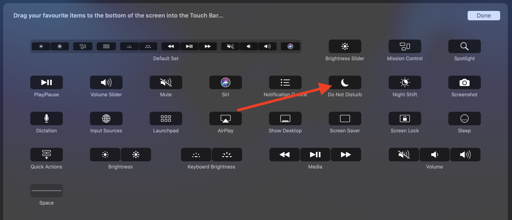
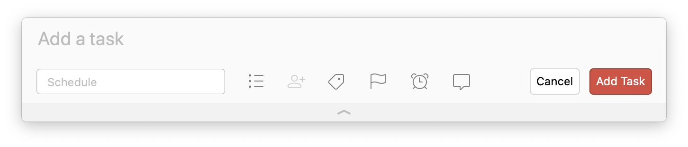

---

layout: post
title: "Fokus!"
abstract: "Alle und alles möchte Aufmerksamkeit. Die Apps auf dem Telefon und die Programme auf dem Computer sind sorgsam darauf ausgerichtet uns freundlich darüber zu benachrichtigen, dass etwas passiert ist. Nett, aber tödlich für einen konzentrierten Arbeitstag. Hier sind fünf Schritte, um den Fokus zu behalten!"
categories: Notion
background: berg

---

## Den Computer die Arbeit machen lassen

Das ist das beste, wenn auch widerwillig hilft der Computer dabei, Ablenkungen zu vermeiden. Seit ein paar Versionen bringt Mac OS X die "Nicht stören" Funktion auch auf den Desktop. Und die solltest Du nutzen! 

Dazu öffne die Systemeinstellungen und gib in das Suchfeld "stören" ein. Dann findest du schnell die Einstellungen. Für die neuen Macs mit Touch Bar ein weiterer Trick: In der Systemeinstellung "Tastatur" versteckt sich der Button "Control Strip anpassen".

Dort ziehe den Knopf "Nicht stören" in die Touch Bar hinein. Ab sofort steht der Knopf immer zur Verfügung. Für Meetings, für Fokus, zum aktvieren deines Flows!

## Das Telefon zum schweigen bringen

Das schönste wäre, das Telefon komplett auszuschalten. Aber mindestens für die 2-Faktor-Authentifizierung muss es ja doch wieder in die Hand genommen werden. Oder für den Peace of Mind State im Kopf, könnte ja gerade etwas passiert sein.

Wenn etwas passiert ist, wirst du angerufen. Alles andere sollte keine Benachrichtigung erzeugen. Die Antwort auf die Frage der Apps "Dürfen wir dich benachrichtigen" sollte immer "Nein" lauten. Du kontrollierst, wann du dich mit welcher App auseinander setzen möchtest.

Die iPhones untersützten einen "Nicht stören" Modus, wie oben vorgestellt der Computer. Nutze ihn!

## Den Kopf zum schweigen bringen

Nachdem Computer und Telefon ruhiger geworden sind, gibt es nur noch einen der unsere Aufmerksamkeit gefangen nimmt. Der eigene Kopf! Wann immer man versucht sich auf eine Sache zu konzentrieren, fallen einem tausend weitere ein. Besonders wenn die eine Sache nicht die spannendste Aufgabe von allen ist.

Ich nutze Todoist und habe einen globalen Shortcut definiert (Command + Option + A) um eine neue Aufgabe hinzuzufügen.

Wann immer also der Kopf sich eigentlich konzentriert und allerlei andere Ideen produziert, fließen sie als neue Aufgabe in die Inbox, und so ist erstmal Ruhe!

## Das stile Kämmerlein

Im Idealfall hat man sich schon physisch an einen ruhigeren, ablenkungsfreien Ort zurück gezogen. Die Benachrichtigungen deaktiviert und Todoist eingerichtet, aber eins bleibt: Die achthundert offenen Tabs. Die unsortierten Dateien. Das E-Mailprogramm und Slack, die zwar nicht aktiv rumschreien, die man aber trotzdem kurz mal anklicken könnte, es könnte ja etwas wichtiges...

Eine tolle Lösung ist ein weiteres Nutzerkonto auf dem Computer. Auf den meisten meiner Rechner habe ich einen Nutzer "Focus" eingerichtet. Ohne Hintergrundbild, ohne installierte Apps und Messanger, besteht der nur aus der einen Anwendung, in der ich konzentriert arbeiten möchte.

Ein Nutzeraccount in dem genau ein Tab offen ist. Der absolute Produktivitätsboost - versuch es einfach aus. Dein Computer hat nichts dagegen, mehrere Accounts zu verwalten.

## Künstlicher Stress fürs Gehirn

Das Gehirn funktioniert am besten unter Druck. Wenn also alle Ablenkungen minimiert sind, dann lohnt es sich einen Timer zu setzen. Ob das 25 Minuten sind wie bei Pomodoro, das bereits mein [Taktgeber im Home Office ist](https://www.interaktionsdesigner.de/2020/konzentriert-und-fit-im-home-office) oder 50 Minuten wie ein [toller Coach](https://bjoernkurtenbach.de/) mir geraten hat, bleibt dir überlassen.

Einzig der Tipp einen Timer zu setzen, sich selbst klar zu machen für welche Aufgabe der folgende Zeit-Slot reserviert ist, und alles andere getrost auf später zu verschieben, ist Gold wert!