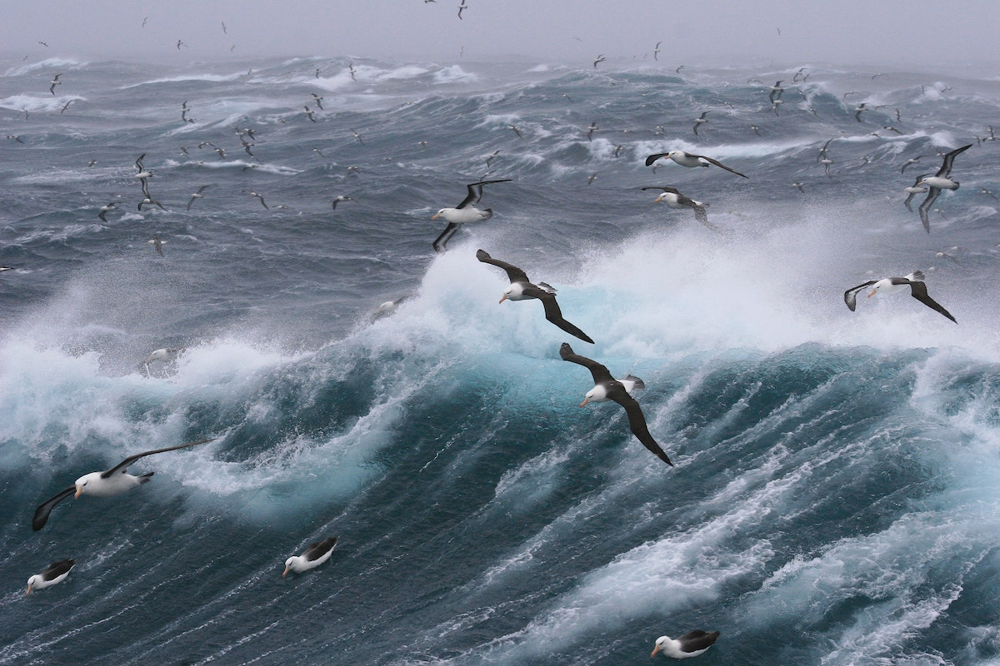

---

layout: post
title: "Stürmische Zeiten im Wasserglas"
abstract: "Startups sind die ganze Zeit im Umbruch. Ein berühmtes Zitat sagt: Wenn du es unter Kontrolle hast, bist du zu langsam. Und so verschieben sich die Dinge ununterbrochen. Der Markt, die Erwartungen und das Team.
In den letzten fünfzehn Jahren habe ich in allen Arten von Teams gearbeitet, als Angestellter, Freelancer und in führenden Positionen. Was passiert, wenn Teams umgestellt werden müssen? Wenn die Firma neu strukturiert wird, damit die Organisation die Strategie widerspiegelt? Diesen Sturm habe ich mir aus allen Perspektiven angeschaut. Diese fünf Punkte sind immer gleich."
categories: Notion
background: sturm

---

## Informationen sind Vertrauen
Auch wenn es bei manchen Diskussionen anders rüber kommt (Du hast die Kaffeemaschine nicht sauber gemacht - aber du hast keine Mate nachgelegt), arbeiten wir in Teams aus erwachsenen Menschen. Und diese übernehmen Verantwortung, wenn man ihnen Vertrauen entgegen bringt. Das gegenseitige Vertrauen manifestiert sich, wenn offen und klar über die entscheidenden Informationen gesprochen wird, wenn die Menschen eingebunden werden. Und wenn dem Team Zeit gegeben wird, mit der Information umzugehen. Informationen haben unterschiedlichen Wert und die wertvollen sind jene, welche noch nicht per Pressemitteilung in eine überforderte Welt hinaus posaunt wurden. Dieser Wert überträgt sich auf das Team. Überhaupt, das Team!

## Das Kernteam wird der Fels in der Brandung
Die Welt im Ganzen und der Markt im Speziellen ist im ständigen Wandel. Der macht es Notwendig auch die internen Strukturen dem anzupassen. Seit Corona, Remote Work und Homeoffice hat sich die Interaktionsfläche mit der Firma auf das Kernteam reduziert, welches man tagtäglich im Daily sieht; auf die, deren Slack Nachrichten man noch wirklich liest. Diese Einheit ist die treibende Kraft geworden, zum Fels in der Brandung, wenn Welt, Markt und dann auch Struktur durcheinander gewirbelt werden. Bei allen Neuerungen muss dieses Team so stabil wie möglich bleiben und mit Informationen gewertschätzt werden. Bis es dann mit einem großen Knall neu geformt wird.

## Big bang statt gemeinsamer Agilität
Wir lieben agile Arbeit! Wir wissen nicht wohin uns die Reise führt und wir haben uns super flexible und enorm anpassbare Arbeitsweisen antrainiert. Damit das durchgeführt werden kann, braucht das Team einen Anker, ein solides Fundament, auf dem es stehend, jetzt entscheidet, was es gleich tut.
Und das lässt sich nicht Stück für Stück umbauen. Das Team ist angewiesen auf die Wertschätzung durch das ihm entgegengebrachte Vertrauen und steht als Fels in der Brandung. Wenn es neu strukturiert wird, passiert das mit einem großen Knall, der einen genauen Plan beinhaltet, welcher vorab besprochen wurde.

## Die großen 25%
Es benötigt 25% der Teilnehmenden einer Gruppe um eine Bewegung in Gang zu setzen. Was in Gesellschaften funktioniert, lässt sich auch auf Teams übertragen. Deshalb bespricht man mit einem Viertel die Änderungen vorab, vertraulich, mit der Erklärung der Theorie eines großen Knalls, einer Wertschätzung durch Informationen, durch das ehrliche Interesse und dem Willen, durch Feedback den Knall lauter und den Plan besser zu machen. Und dem Team zu helfen, das neue Fundament schneller zu verstehen, denn es wird stärker und stabiler.

## Ehrliche Gefühle und Aufbruchstimmung
Menschen sind Gewohnheitstiere und wollen, dass sich nichts verändert. Ein Führungsteam muss diese Beständigkeit ausstrahlen und immer wieder erklären, warum die kleinen Veränderungen zu einer größeren, stabileren Struktur führen. Wohin wir als Firma steuern. Und das ist nicht nur die Geschäftsführerin, die im All Hands der Kamera immer näher kommt, das zieht sich einmal durch die Reporting Line. In einer Zeit, in der jedes soziale Netzwerk einen mit Jobangeboten bombardiert, will ich von meinen Kolleginnen und Kollegen hören warum wir hier sind, und tun, was wir gerade geplant haben. Unsere Arbeit muss in eine Geschichte eingebettet sein und es ist kein Problem diese Geschichte so oft zu hören, bis man sie auswendig kann. Und dann anfängt sie wirklich zu glauben.

_Disclaimer_

Ich habe die letzten anderthalb Jahrzehnte in der Digitalbranche verbracht. Das hat meine Sicht leicht beeinflusst und der Artikel erhebt weder Anspruch auf Vollständigkeit, noch auf universale Gültigkeit. 
