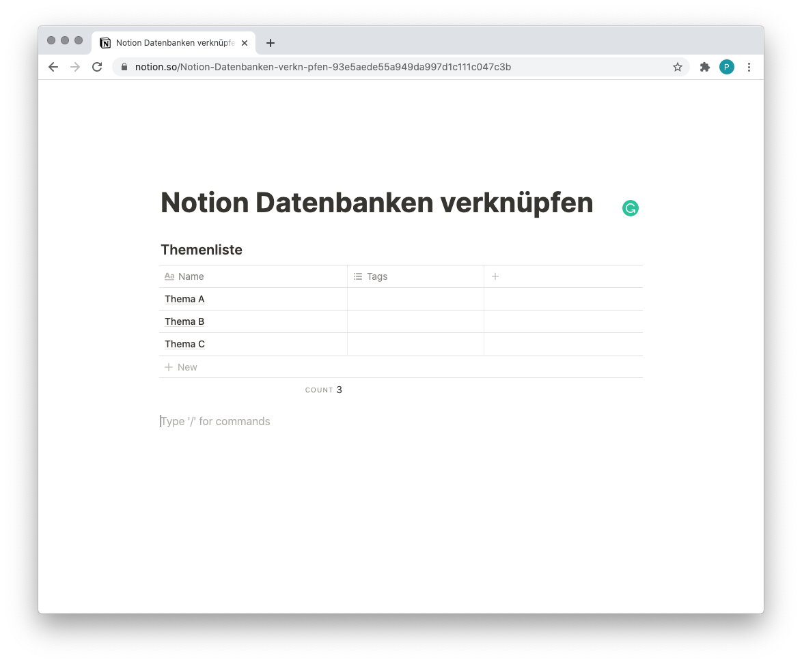
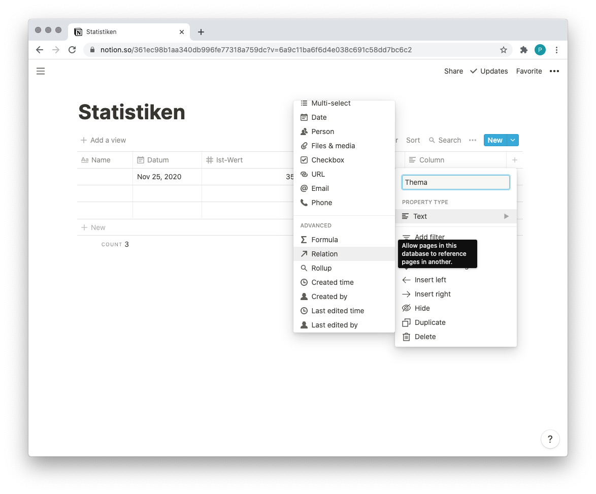
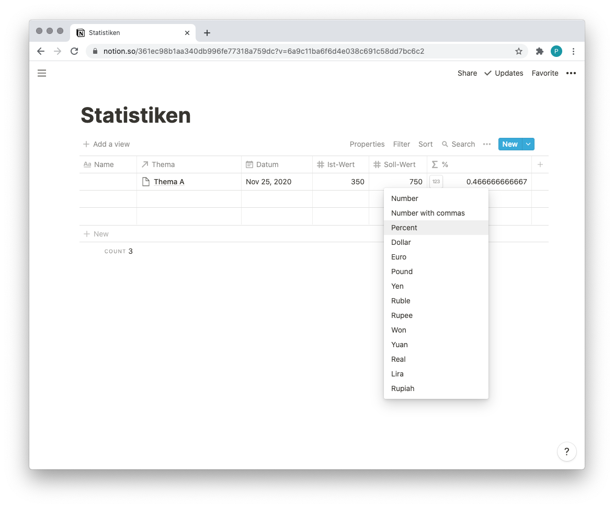
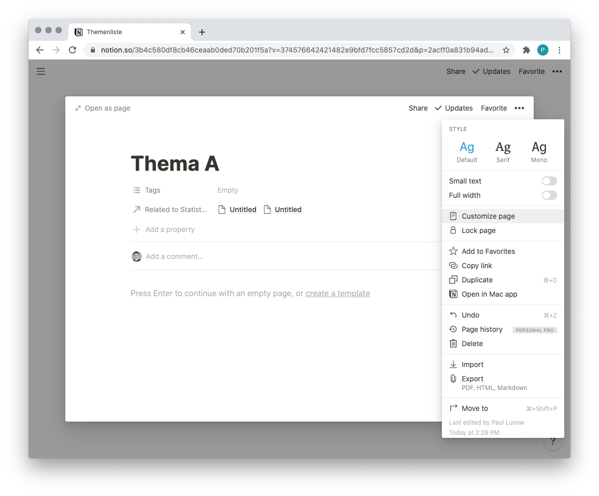
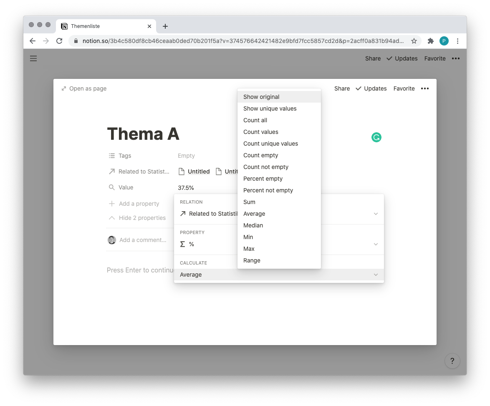
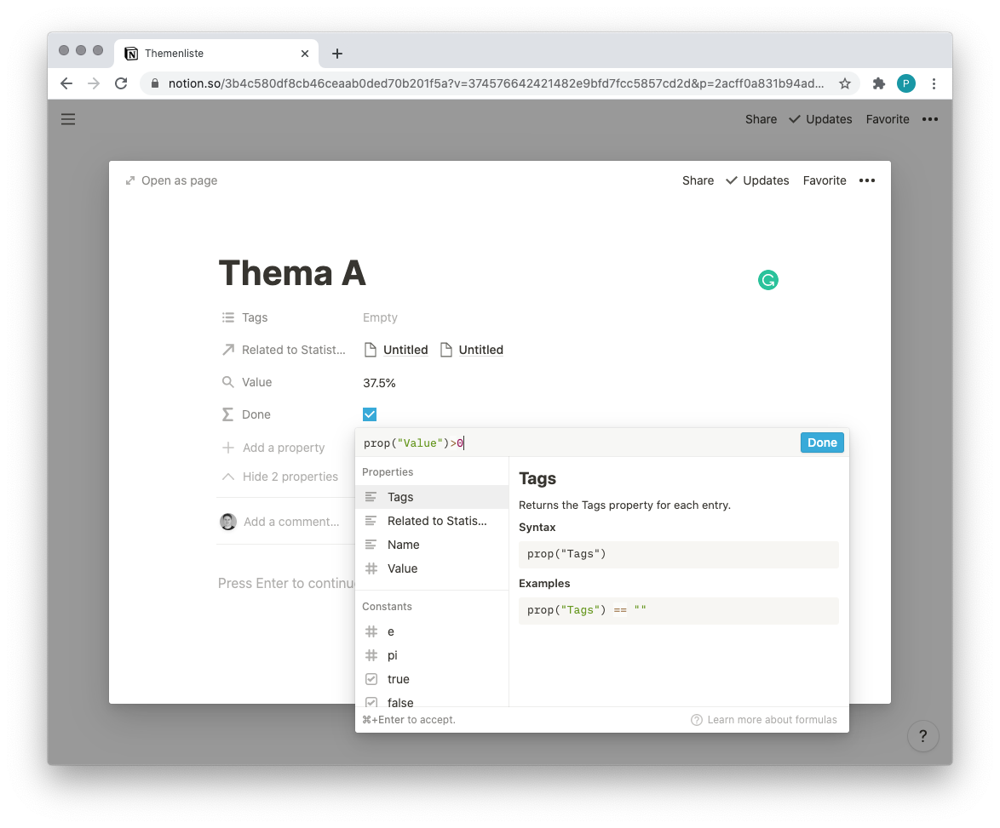

---

layout: post
title: "Notion Timetracking"
abstract: "Notion ist eine No-Code Plattform, in der nahzu jedes Tool nachgebaut werden kann. Mit dem unschlagbaren Vorteil, dass auf einmal alles miteinander verbunden werden kann, und eine zentrale und holistische Wissensdatenbank entsteht, die nicht nur in der tagtäglichen Arbeit hilft, sondern auch einen idealen Einstieg in das Thema bietet."
categories: Notion
background: notion-office-2

---

Natürlich ist ein Timetracking in Notion nicht so fortgeschritten wie eine ausschließlich dafür optimierte Anwendung. Aber für 90% der Fälle ist der grundsätzliche Start entscheidend, und nicht das Featureset. Ich schlage also immer vor eine Notion Anwendung zusammen zu klicken, und wenn die Nutzung davon in den Arbeitsalltag übergegangen ist und an seine Grenzen stoßen sollte, dann denken wir über den Einsatz einer spezialisierten Software nach.

# Monatliche Übersicht

Pro Monat verbringe ich Zeit auf Projekten. Deren verfügbares Zeitbudget und den Fortschritt möchte ich in einer Übersicht darstellen. Der perfekte Zweck 

Notion startet auf einer leeren Seite, einem minimalistischen Interface für ablenkungsfreies Schreiben. In diesem Blog beschreibe ich im Post [Datenbanken in Notion](https://www.interaktionsdesigner.de/2020/datenbanken-in-notion) einen Einsatzzweck.

Aber das Notion Team wächst und wächst und haut (endlich wieder) ein Update nach dem anderen raus. Mit jedem Update wird die Nutzung vorallem für Einsteiger und Nutzende leichter. Notion hat auch einen hervorragenden Kundensupport, dessen geheimes Feature ich nun kennenlernen durfte: Vor Monaten habe ich nach einem Feature gefragt und wurde mit der üblichen Antwort "Es ist auf unserer Roadmap" vertröstet. Nun wurde dieses Feature veröffentlicht und ich habe eine individuelle Mail über den Launch der Funktion erhalten. So muss ein Customer Support aus meiner Sicht funktionieren. Ich hoffe das Team kann diese Qualität mit wachsender Bekanntheit weiter durchhalten.

# Statistische Daten in Notion ablegen

In vielen Projekten gibt es Datenbanken mit vielen Einträgen zu spezifischen Themen. In einem meiner Projekte werden diese Themen mit statistischen Daten angereichert. Nun wäre eine nahliegende Idee eine lange Liste mit Eigenschaften in der Datenbank anzulegen um diese Werte zu speichern. In kürzester Zeit würde dieser Ansatz sehr unübersichtlich werden.

Der Übersichtlichkeit lege ich eine zweite Inline Datenbank für dieses Beispiel an, in der echten Welt wäre dies ein guter Einsatzzweck für eine Datenbank als Seitentyp.

Meine Statistik besteht aus dem obligatorischen Namenfeld, jede Datenbank muss eine haben, sie muss aber nicht zwingend ausgefüllt werden. Dem Datum, einem Ist- und einem Soll-Wert. Und der Relation zur Themenliste.

Zu jedem Thema können beliebig viele Statistikeinträge hinzugefügt werden. Diese enthalten zum Beispiel Informationen zum Fortschritt, Entscheidungen oder offene Aufgaben.

Die Stärke von rekursiven Strukturen kommt hier zum Einsatz: Jeder einzelne Eintrag kann eine eigene Notion Seite mit allen Werkzeugen beinhalten. Jede Stärke bringt auch Verantwortung mit sich. Irgendjemand muss ein Konzept machen, wie Daten abgelegt werden um die Übersichtlichkeit zu gewährleisten.

## Prozentzahlen ausrechnen und runden

Für das einfache Weiterarbeiten sollen die beiden absoluten Werte in eine relative umgerechnet werden um eine Vergleichbarkeit herzustellen. Das ist einfach und gelingt über eine neue Eigenschaft vom Typ `Formula`.

	prop("Ist-Wert") / prop("Soll-Wert")

Fährt man mit der Maus über den neu errechneten Wert, erscheint links in der Zelle ein Button "123". Über diesen lässt sich das Format bestimmen. 

Nun wird ein Prozentzeichen am Ende angezeigt, aber immer noch 20 Kommastellen. Seltsamer Weise lässt sich bei der Runden-Formel von Notion keine Nachkommastelle angeben, weshalb ein Trick angewendet werden muss. Der Trick des Multiplizierens und Dividierens.

	round(prop("Ist-Wert") / prop("Soll-Wert")*100)/100

Für eine Nachkommastelle dividert und multipliziert man mit 1000 usw.

# Sichtbarkeit der Eigenschaften

Mit dem neusten Update lässt sich genauer steuern, wann welche Eigenschaft (bzw. Spalte) einer Datenbank angezeigt werden soll. Nach dem hinzufügen der Relation, erscheint in der Datenbank der Themenliste ein neues Feld "Related to Statistiken". Das ist hässlich und bringt keinen Mehrwert, mit einem Klick auf den Zellen-Header und "Hide" verschwindet sie.

Neu ist, dass nun auch in die Anzeige eines Eintrags gesteuert werden kann. Dazu öffnet man eine Zeile und klickt auf den drei Punkten rechts oben auf "Customize Page".

Hier lassen sich nun Eigenschaften wie `Tags` und `Related to Statistiken` ausblenden oder nur anzeigen wenn sie Werte beinhalten. Beides weg, wir wollen an die Werte der Statistiken!

## Per Rollup Daten aus anderen Tabellen anzeigen

Ein neues Feld vom Typ `Rollup` mit dem Namen "Value" wird angelegt. Ein Klick auf das Wort "Empty" rechts neben dem Label öffnet die Konfiguration. 

Je nach Anwendung stellt Notion eine Reihe von Berechnungen bereit. Sobald der Rollup Wert da ist, lässt sich dieser in umfangreicheren Szenarien auch ausblenden und in einer Formel weiter verarbeiten.

# Checkboxen

Nun ist es im Projekt entscheidend, ob zu einem Thema schon eine Statistik angelegt wurde oder noch nicht. Die Visualisierung davon ist super einfach! Wie erwähnt, lässt sich der Wert aus einem Rollup in einer Formel weiter verarbeiten. Und Notion besitzt sehr smarte Standardwerte.

Im Feld "Done" vom Typ `Formula` wird die Abfragen

	prop("Value") > 0

eingetragen. Notion erkennt die logische Bedingung und visualisiert automatisch eine Checkbox! Die kann jetzt in der Übersicht beliebig positioniert werden.

# Verschiedene Ansichten auf die gleichen Daten

Nun liegt es nahe, nur die Themen anzuzeigen, welche noch keine Statistikverknüpfung haben. Oder umgekehrt, je nach Einsatz. Beides lässt sich mit wenigen Klicks in Notion realisieren. 

Links oben innerhalb der Tabelle klickt man auf "Add a view". In dieser Ansicht kann man Daten filtern und sortieren, je nach Einsatzzweck.

# Fazit

All das kann man sich online anschauen, in meiner persönliche Notion Instanz: [Notion Datenbank verknüpfen](https://www.notion.so/3b4c580df8cb46ceaab0ded70b201f5a?v=374576642421482e9bfd7fcc5857cd2d). Mit einem Klick lässt sich eine Notion Seite im Web veröffentlichen!

Wer meinen vorherigen Artikel [Datenbanken in Notion](https://www.interaktionsdesigner.de/2020/datenbanken-in-notion) aufmerksam gelesen hat, kann dieses Wissen nutzen, und für sein Team eine personalisierte Themen und Statistikliste aufbauen.

Ich habe bewusst ein abstraktes Beispiel genommen, in der Hoffnung, dass dies es besser ermöglicht den eigenen Einsatzweck beim lesen mitzudenken. Hinterlass gern einen Kommentar oder schreib mir eine Nachricht ob das der Fall ist, oder ein konkretes Beispiel verständlicher wäre.

Es tut mir leid, wenn sich dieser Post wie eine Notion Werbung liest. Ist es nicht. Ich bin großer Fan. Das Header Bild des Eintrags ist übrigens ein Foto aus dem Notion Büro. Das kann man sich im [Media Kit](https://www.notion.so/Media-Kit-205535b1d9c4440497a3d7a2ac096286) runterladen.
